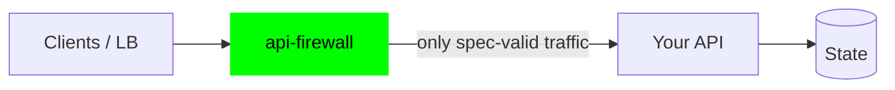

# API Firewall integration patterns

How to put the firewall in front of an API, for every deployment shape in
this repo. Each pattern below is self-contained; the common thread is
always the same three decisions:

1. **Where does the spec come from?** (hand-written, exported from code, or
   vendor-provided)
2. **How does the firewall reach the backend?** (same compose project,
   external network, host, or cluster Service)
3. **Who terminates TLS?** (your LB, the firewall, or nobody yet)



---

## 1. Sidecar in the same compose project (default)

What the top-level [docker-compose.yml](../docker-compose.yml) does: the
backend joins the internal `backend` network and the firewall is the only
service on both networks.

```dotenv
# .env
APIFW_SPEC_FILE=specs/your-api.json
APIFW_SERVER_URL=http://your-api:3000
```

Add your API to the compose file on the `backend` network (internal: no
outbound routing, unreachable from the host). Clients hit the firewall's
published port; nothing can bypass it.

## 2. Protecting an API in *another* compose project

Attach the existing container to this project's backend network — no
changes to the other project's files:

```sh
docker network connect api-firewall_backend that-app-container
# .env: APIFW_SERVER_URL=http://that-app-container:3000
```

Or the inverse — attach the firewall to the other project's network by
adding an external network to the compose file. Then **remove the
backend's published port** so the firewall becomes the only entry point.

## 3. Protecting a host-local or remote API

Point `APIFW_SERVER_URL` at anything routable from the container:

```dotenv
APIFW_SERVER_URL=http://host.containers.internal:3000   # podman, host API
APIFW_SERVER_URL=https://api.internal.example.com       # remote upstream
APIFW_SERVER_ROOT_CA=/opt/resources/certs/internal-ca.pem  # private CA
```

For remote HTTPS upstreams, mount the CA under `./certs` — never use
`APIFW_SERVER_INSECURE_CONNECTION=true` outside a lab.

## 4. Spec-from-code (recommended when you own the API)

**The [uat/](../uat/) environment is the worked example of this pattern.**
If your framework generates OpenAPI (FastAPI, Spring, NestJS, …), feed the
firewall the *generated* document instead of maintaining a copy — the
enforced contract can then never drift from the code:

```sh
# FastAPI: print the app's real spec (see uat/backend/export_spec.py)
python -c 'import json, main; print(json.dumps(main.app.openapi()))' > openapi.json
```

Two gotchas learned from the UAT battery (also caught by
[troubleshooting/spec-check.sh](../troubleshooting/spec-check.sh)):

- The firewall parses **OpenAPI 3.0.x only**. Modern FastAPI/pydantic-v2
  emit 3.1 (numeric `exclusiveMinimum`) which crash-loops the firewall.
  Pin a 3.0-emitting generation (FastAPI ≤0.98/pydantic v1) or convert.
- Endpoints you don't want reachable through the firewall must be
  **excluded from the spec** (`include_in_schema=False`) — positive
  security means "not in spec ⇒ blocked", which is exactly how the UAT
  keeps its `/_uat/*` introspection internal.

Re-export in CI on every backend release; `APIFW_SPECIFICATION_UPDATE_PERIOD=1m`
hot-reloads the mounted file without restarts.

## 5. TLS: firewall-terminated or behind your LB

- **Behind an existing LB/ingress** (typical): keep the firewall on plain
  HTTP, terminate TLS at the edge you already run, and set
  `APIFW_ALLOW_IP_HEADER_NAME=X-Forwarded-For` *only if* that LB is the
  sole path to the firewall.
- **Firewall-terminated**: `./tls-gen.sh` (test CA) or drop real certs in
  `./certs/`, then `APIFW_URL=https://0.0.0.0:8080`.

## 6. Kubernetes

[kubernetes/api-firewall-k8s.yaml](../kubernetes/api-firewall-k8s.yaml):
firewall Deployment (stateless, 2+ replicas) + Service; your Ingress routes
to the **firewall's** Service, and a NetworkPolicy makes the firewall the
only pod allowed to reach the API pods. Spec ships as a ConfigMap — wire
your CI to `kubectl create configmap --from-file` on API releases.

## 7. Full stack: firewall → API → SQL ([sql-backend/](sql-backend/))

A complete, scalable reference deployment for data-backed APIs: the
firewall fronts a horizontally scalable FastAPI service that shards a
record store across multiple SQL Server containers (the architecture from
[sql/](../../sql/), hardened behind the firewall). Use it as the template
for any "API over a database" use case — see its README for scaling,
sharding, and adaptation notes.

## 8. GraphQL

`APIFW_MODE=GRAPHQL` validates queries/mutations/subscriptions against a
GraphQL schema (max depth, node limits, introspection blocking) instead of
OpenAPI — [upstream guide](https://docs.wallarm.com/api-firewall/installation-guides/graphql/docker-container/).

---

## Rollout playbook (any pattern)

1. `troubleshooting/spec-check.sh your-spec.json` — catch parser problems
   before the first start.
2. Start with `APIFW_REQUEST_VALIDATION=LOG_ONLY` + `APIFW_RESPONSE_VALIDATION=LOG_ONLY`;
   watch the logs for false positives and shadow endpoints.
3. Flip request validation to `BLOCK`; keep per-endpoint exceptions in
   `APIFW_ENDPOINTS` (e.g. `GET:/health|DISABLE|DISABLE`).
4. Cut traffic over (LB/ingress → firewall) and firewall the backend so
   the firewall is the only path in.
5. Layer on WAF (`get-crs.sh`), token denylist, IP allowlist as needed.
6. Prove it: run the [uat/](../uat/) battery pattern against *your* stack,
   and `troubleshooting/firewall-probe.sh` after every config change.
