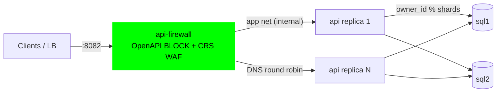

# Firewall → API → sharded SQL: full-stack reference

A complete, scalable deployment for "API over a database" use cases: the
Wallarm API Firewall fronts a stateless FastAPI **record-store** service
that shards data across multiple SQL Server containers — the gateway/shard
architecture from this repo's [sql/](../../../sql/) directory, hardened
behind a positive-security firewall.



```sh
cp .env.example .env      # set SQL_SA_PASSWORD + SQL_API_KEYS
./smoke-test.sh           # build, start, verify end-to-end (--keep to leave up)
```

## Why this shape

| Layer | Role | Scaling story |
| --- | --- | --- |
| **api-firewall** | Only entry point. Blocks anything outside the OpenAPI contract, plus CRS WAF (SQLi/XSS/scanners) *before* the app | Stateless — replicate behind your LB |
| **api** (FastAPI + pymssql) | Typed CRUD over `(owner_id, kind, data-JSON)` records; 100 % parameterized SQL; validates API keys | Stateless — `docker compose up -d --scale api=3`; load-balanced across the A-records resolved at pool init (see caveat below) |
| **sql1..N** | One database per shard; owner routed by `owner_id % N` | Add `sqlN` service + volume, extend `SQL_SHARDS` |
| networks | `edge` → `app` (internal) → `data` (internal) | DBs unreachable except from the API tier; API unreachable except through the firewall |

Defense in depth against injection specifically:

1. CRS 942xxx rules block SQLi-shaped payloads at the edge (403).
2. The spec constrains `kind` to `^[a-z0-9_-]+$` and types every parameter
   — most injection never fits the schema (403).
3. The API only ever runs parameterized queries — anything that still
   arrives is inert data.

## Multiple use cases, one API

Records are `{kind: str, data: {…}}` per owner — tasks, events, profiles,
telemetry, carts all fit without schema changes:

```sh
curl -s -X POST http://127.0.0.1:8082/v1/owners/7/records \
  -H 'X-API-Key: demo-key-1' -H 'Content-Type: application/json' \
  -d '{"kind":"task","data":{"title":"rotate keys","due":"2026-08-01"}}'
```

To adapt to a typed domain instead: replace the `records` model/table in
[api/main.py](api/main.py) + [api/db.py](api/db.py), re-export the spec
(`docker run --rm localhost/apifw-sql-api python3 export_spec.py`), restart
the firewall. The contract the firewall enforces is always generated from
the code (see [integrations pattern 4](../README.md#4-spec-from-code-recommended-when-you-own-the-api)).

## Scaling & operations

- **API tier**: `docker compose up -d --scale api=3`. Replicas are
  identical and stateless; shard routing is deterministic, so no
  coordination is needed. **Load-balancing caveat** — the firewall spreads
  requests across the API A-records it resolves *when its upstream pool
  initialises*, and does not re-resolve DNS per request. So replicas added
  after the firewall started aren't used until its pool re-dials (restart
  the firewall, or let idle connections expire). Verified: with both
  replicas present at firewall start, 40 concurrent requests split ~22/18.
  For elastic autoscaling, point `APIFW_SERVER_URL` at a stable VIP — a
  dedicated LB, or a Kubernetes Service (kube-proxy load-balances; this is
  what [kubernetes/api-firewall-k8s.yaml](../../kubernetes/api-firewall-k8s.yaml)
  does) — instead of relying on raw compose DNS.
  > podman-compose 1.3.0 does not honour `--scale` reliably; use real
  > `docker compose`, or start extra replicas manually on the `app`+`data`
  > networks with `--network-alias api`.
- **Adding a shard**: add a `sql3` service + volume, extend
  `SQL_SHARDS=sql1:1433,sql2:1433,sql3:1433`. The API bootstraps the
  schema on any new shard at startup. ⚠ Modulo routing means adding
  shards **re-maps owners** — do it before real data, or plan a migration
  (the [sql/ gateway example](../../../sql/api-gateway/) shows the
  Redis-mapped variant that supports live re-sharding).
- **Credentials**: `.env` only (git-ignored). For production move to
  secrets management, per-shard logins with least privilege instead of
  `sa`, and TLS on SQL connections.
- **Monitoring**: `GET /v1/shards` (API-key gated) reports per-shard health
  and row counts; the firewall exports Prometheus metrics on `:9010`.
- **Diagnostics**: the [troubleshooting/](../../troubleshooting/) scripts
  work against this stack:
  `FIREWALL_CONTAINER=apifw-sql-firewall EDGE_URL=http://127.0.0.1:8082 ../../troubleshooting/firewall-probe.sh`

## Smoke test coverage

`./smoke-test.sh` verifies: CRUD through the firewall into SQL; records for
different owners landing on **different shards**; documented 404s passing;
missing API key / wrong types / SQLi-shaped `kind` / unknown fields /
unknown paths all blocked (403); scanner UA blocked by CRS; and row counts
queried **inside each SQL container** to prove persistence.
