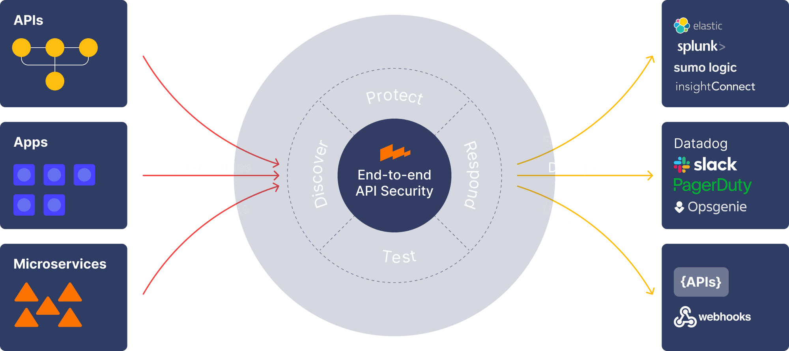

# Wallarm API Firewall

Production deployment of [Wallarm API Firewall](https://github.com/wallarm/api-firewall)
(v0.9.6): a high-performance reverse proxy that enforces a **positive security
model** — only requests that match your OpenAPI 3 specification reach the
backend; everything else is rejected at the edge. Response validation,
shadow-API detection, a Coraza WAF layer with the OWASP Core Rule Set, token
denylisting and source-IP allowlisting are layered on top. Drop in a spec,
point it at any REST (or GraphQL) API, and it becomes the only path to that
API.



```
client ──> api-firewall:8080 ──> your API
             │  1. IP allowlist (optional)
             │  2. token denylist (optional)
             │  3. Coraza WAF + OWASP CRS (optional)
             │  4. OpenAPI request validation   BLOCK / LOG_ONLY
             └─ 5. OpenAPI response validation  LOG_ONLY / BLOCK
```

## Layout

```
.
├── docker-compose.yml             # hardened compose stack (+ demo profile)
├── Dockerfile                     # builds api-firewall from source on pinned alpine
├── entrypoint.sh
├── .env.example                   # every tunable, documented — cp to .env
├── tls-gen.sh                     # optional: local CA + server cert into ./certs
├── get-crs.sh                     # optional: OWASP CRS into ./crs
├── specs/                         # OpenAPI specs mounted into the firewall
│   ├── httpbin-demo.json          #   pairs with the demo backend
│   └── example-openapi_spec.json  # spec-authoring reference
├── config/
│   ├── coraza.conf                # Coraza/ModSecurity engine settings
│   ├── allowed.iplist.db          # source-IP allowlist (CIDRs, one per line)
│   ├── tokens.denylist.db         # revoked tokens (one per line)
│   ├── api-fw-csr.conf            # server-cert CSR (edit SANs for your host)
│   └── ca-csr.conf                # local CA settings for tls-gen.sh
├── kubernetes/api-firewall-k8s.yaml
├── uat/                           # acceptance test: FastAPI mock + 25-case battery
├── integrations/                  # integration patterns + full firewall/API/SQL stack
├── troubleshooting/               # read-only diagnostic scripts
└── archive/                       # previous python/ansible deployer
```

**Integrating with an existing API?** Start with
[integrations/README.md](integrations/README.md) — sidecar, external
project, spec-from-code, TLS/LB, Kubernetes, GraphQL, and a complete
[firewall → API → sharded SQL](integrations/sql-backend/) reference stack.
When something misbehaves, [troubleshooting/](troubleshooting/) pinpoints
the failing layer.

## Quickstart (demo)

Runs the firewall in front of a disposable [go-httpbin](https://github.com/mccutchen/go-httpbin)
backend using the bundled spec:

```sh
docker compose --profile demo up -d --build

# Allowed by the spec:
curl -i "http://127.0.0.1:8080/get?limit=10"           # 200
curl -i -X POST http://127.0.0.1:8080/post \
     -H 'Content-Type: application/json' -d '{"name":"ship it"}'   # 200

# Rejected by the firewall (never reach the backend):
curl -i "http://127.0.0.1:8080/get?limit=notanumber"   # 403  wrong type
curl -i "http://127.0.0.1:8080/status/abc"             # 403  path param not int
curl -i "http://127.0.0.1:8080/anything"               # 403  not in spec
curl -i -X POST http://127.0.0.1:8080/post \
     -H 'Content-Type: application/json' -d '{"nope":1}'           # 403
```

Blocked requests are logged (JSON) — `docker compose logs -f api-firewall`.

## Protecting your API

1. **Spec** — put your OpenAPI 3 JSON in `specs/` (the firewall is only as
   strict as the spec; document every parameter, type, and required field).
2. **Configure** — `cp .env.example .env`, then set at minimum:
   ```dotenv
   APIFW_SPEC_FILE=specs/your-api-openapi.json
   APIFW_SERVER_URL=http://your-api:3000
   ```
   If the API runs in another compose project, attach its container to this
   project's `backend` network (`docker network connect api-firewall_backend
   <container>`) or set `APIFW_SERVER_URL` to any address routable from the
   firewall container.
3. **Start** — `docker compose up -d --build`, then cut traffic over: point
   your LB / ingress / clients at the firewall (default publish
   `127.0.0.1:8080`, override with `APIFW_PUBLISHED_ADDR`) and firewall the
   backend so only the api-firewall container can reach it.

### Rollout: observe first, then block

Start non-disruptively, watching for false positives and shadow endpoints:

```dotenv
APIFW_REQUEST_VALIDATION=LOG_ONLY     # log violations, forward traffic
APIFW_RESPONSE_VALIDATION=LOG_ONLY
```

In `LOG_ONLY` mode the firewall also reports **shadow APIs** — endpoints your
backend serves that are missing from the spec — and unknown parameters. Once
the log is clean, flip request validation to `BLOCK` (and response validation
too, if your spec documents every response). Per-endpoint exceptions go in
`APIFW_ENDPOINTS`, e.g. `GET:/health|DISABLE|DISABLE`.

## Optional layers

| Layer | Enable |
| --- | --- |
| **WAF (Coraza + OWASP CRS)** | `./get-crs.sh`, then uncomment the `APIFW_MODSEC_*` block in `.env`. Engine settings in `config/coraza.conf`; custom rules can be added to the CRS rules dir or extra conf files. |
| **TLS termination** | `./tls-gen.sh` (or drop real certs in `./certs/`), then `APIFW_URL=https://0.0.0.0:8080`. For upstream TLS set `APIFW_SERVER_ROOT_CA`. |
| **Token denylist** | Revoked tokens in `config/tokens.denylist.db`, then `APIFW_DENYLIST_TOKENS_FILE` + `APIFW_DENYLIST_TOKENS_HEADER_NAME=Authorization` (the `Bearer ` prefix is trimmed automatically). |
| **IP allowlist** | CIDRs in `config/allowed.iplist.db`, then `APIFW_ALLOW_IP_FILE`. Only set `APIFW_ALLOW_IP_HEADER_NAME=X-Forwarded-For` when a trusted LB sits in front — trusting that header from the open internet lets clients spoof their IP. |
| **Spec hot-reload** | `APIFW_SPECIFICATION_UPDATE_PERIOD=1m` re-reads the mounted spec without restarts. |
| **GraphQL** | `APIFW_MODE=GRAPHQL` validates queries/mutations against a GraphQL schema instead of OpenAPI — see the [upstream docs](https://docs.wallarm.com/api-firewall/installation-guides/graphql/docker-container/) for the `APIFW_GRAPHQL_*` variables. |

## Operations

- **Health**: liveness `GET :9667/v1/liveness`; readiness
  `GET :9667/v1/readiness` (also verifies the backend is reachable). The
  compose healthcheck and k8s probes use these.
- **Metrics**: Prometheus on `:9010/metrics` (enabled by default, not
  published to the host — scrape over the compose network, or uncomment the
  port mapping).
- **Logs**: JSON to stdout (`APIFW_LOG_FORMAT=JSON`), rotated by the json-file
  driver (10 MB × 3). Every block includes the violated rule/spec detail.
- **Upgrades**: bump `APIFIREWALL_VERSION` in the Dockerfile (and the base
  image digest), `docker compose build --pull`, then
  `docker compose up -d`. The firewall is stateless — nothing to migrate.
- **CRS updates**: `CRS_VERSION=x.y.z ./get-crs.sh -f`, then restart.

## Hardening notes

- Image builds api-firewall **from source** at a pinned tag on a
  digest-pinned Alpine base; the final stage is scanned with ClamAV during
  build and runs as uid 65535 (`api-firewall`).
- Container runs with `read_only` rootfs, `cap_drop: ALL`,
  `no-new-privileges`, a pids limit, and memory/CPU limits; all mounts are
  read-only, scratch space is tmpfs.
- The backend network is `internal: true` — the protected demo backend has no
  route out; in production, keep your API off the edge network entirely so
  the firewall is the only way in.
- Default publish address is loopback-only.

## Kubernetes

```sh
kubectl apply -f kubernetes/api-firewall-k8s.yaml
```

Edit the two ConfigMaps first (spec + `APIFW_SERVER_URL`), push the locally
built image to your registry, and route your Ingress at the `api-firewall`
Service. The manifest ships liveness/readiness probes on `:9667`, a
restricted securityContext, resource limits, Prometheus scrape annotations,
2 replicas (stateless — scale freely) and an egress NetworkPolicy to adapt.

## Testing the firewall itself

**UAT battery** — [uat/](uat/) spins up a FastAPI mock backend behind the
firewall with every layer enabled and runs 25 acceptance cases (schema
violations, unknown surface, authn, WAF, response validation), asserting
blocked requests never reach the backend:

```sh
cd uat && ./run-uat.sh
```

**gotestwaf** — [gotestwaf](../gotestwaf/) (in this repo) can attack the
deployed firewall and produce a scoring report:

```sh
docker run --rm --network api-firewall_edge \
    -v "$(pwd)/reports:/app/reports" \
    ghcr.io/wallarm/gotestwaf --url http://api-firewall:8080 --noEmailReport
```
