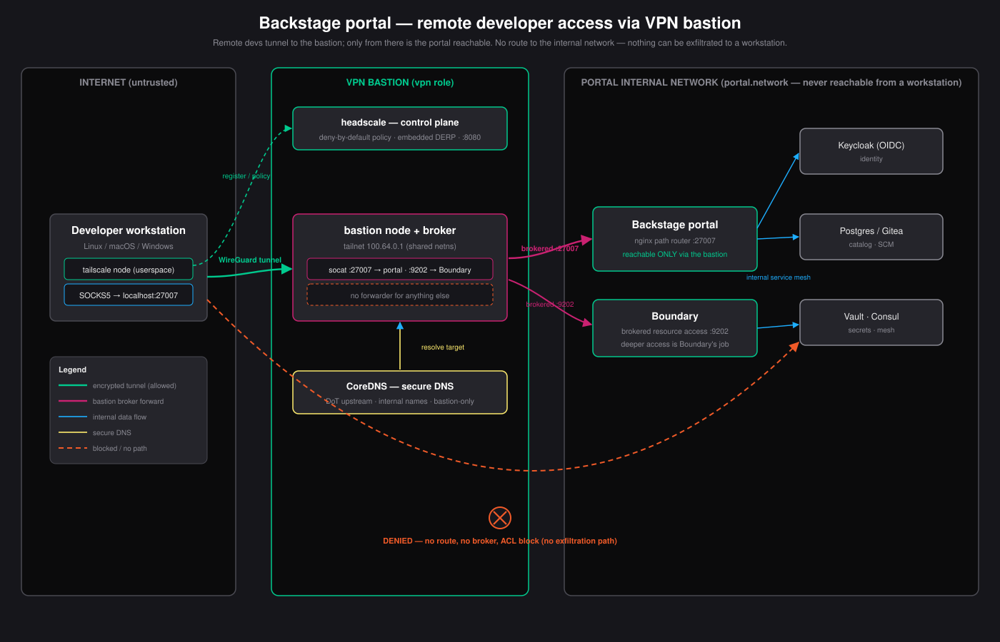

# `vpn` role — remote developer access to the portal

A VPN bastion so **remote developers** can reach the Backstage portal (and
Boundary) without ever being placed on the internal `portal.network`. A
workstation on the internet tunnels to the bastion over a self-hosted
Tailscale/headscale mesh; the bastion **brokers only the portal and Boundary
ports** to it. The workstation has no route to the internal network, so there is
**no path to exfiltrate data** to it.

<p align="center">
  
</p>

## What runs here

| Unit | Role |
|---|---|
| `headscale.container` + `headscale-data.volume` | control plane + embedded DERP relay (the only public door) |
| `coredns.container` | secure DNS (DoT upstream) for resolving internal targets; bastion-only |
| `bastion-ts.container` | the bastion's tailnet node (userspace/netstack) |
| `broker.container` | one `socat` forwarder per authorized target (shares the node's netns) |

Config renders from `hosts.env` into `/etc/backstage-portal/vpn/`
(`headscale.yaml`, `policy.hujson`, `Corefile`, `broker.sh`) and
`/etc/backstage-portal/vpn.env` (`BROKER_TARGETS`, `TS_AUTHKEY`). The
[deny-by-default policy](config/policy.hujson) and `BROKER_TARGETS` are the
allow-list — keep them in lock-step.

## Deploy the bastion

Give the bastion its own VM (`VPN_HOST`), dual-homed: a public interface remote
workstations reach, and `portal.network` to reach the portal/Boundary.

```bash
# hosts.env: set VPN_HOST, VPN_PUBLIC_URL, then bring up the control plane first
./deploy.sh vpn "$VPN_HOST" --prep
# mint the bastion's own node key and re-render:
ssh "$VPN_HOST" 'podman exec portal-headscale headscale users create bastion; \
                 podman exec portal-headscale headscale users create endpoint; \
                 podman exec portal-headscale headscale preauthkeys create --user 1 --reusable --expiration 720h'
# put that key in hosts.env as VPN_BASTION_AUTHKEY, then re-run:
./deploy.sh vpn "$VPN_HOST"
```

## Onboard a developer workstation

Use the ready-made workstation compose in the HashiCorp stack's access layer —
it is identical (a tailnet node + a localhost forwarder), just point it at this
bastion and the portal port:
[`integration-demos/hashicorp-stack/access/endpoint`](../../../../integration-demos/hashicorp-stack/access/endpoint).

```bash
# admin mints a per-developer key:
podman exec portal-headscale headscale preauthkeys create --user 2 --reusable --expiration 168h

# workstation .env: HEADSCALE_URL=$VPN_PUBLIC_URL, ENDPOINT_AUTHKEY=<key>,
#                   BASTION_HOST=<bastion tailnet ip>, FORWARD_PORTS="27007 9202"
podman-compose up -d       # docker compose on macOS/Windows
```

The developer then opens the portal at **http://127.0.0.1:27007** and uses
Boundary at **127.0.0.1:9202** — nothing else on `portal.network` is reachable.

## Verify

The behaviour (authorized path works, everything else denied, secure DNS) is
proven offline by the shared access UAT in the HashiCorp stack:
[`integration-demos/hashicorp-stack/access/uat`](../../../../integration-demos/hashicorp-stack/access/uat) —
same architecture, same broker/policy scripts.

## Troubleshooting

When a developer can't open the portal (or reaches something they shouldn't),
[`troubleshooting/`](troubleshooting) walks the five-hop comm path —
registration → tunnel → policy → broker → DNS — with the diagnostic command and
fix at each break point, plus the Quadlet/systemd-specific gotchas.
