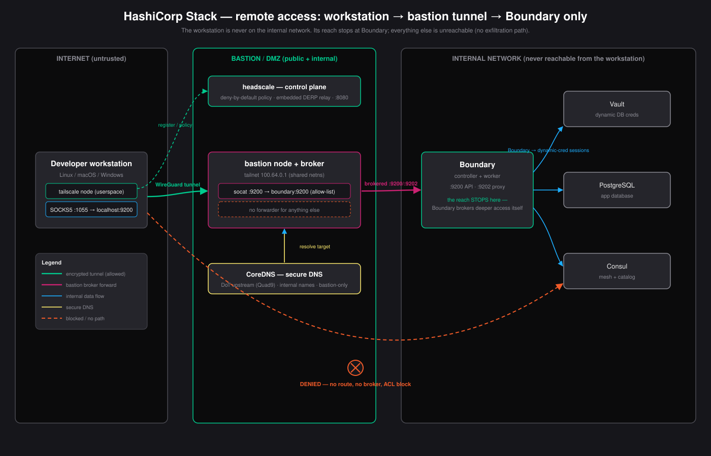

# Remote access layer — workstation → bastion → Boundary

Secure remote access for developers working against the internal HashiCorp
stack. A developer on the internet tunnels to a **bastion** (jump host) over a
self-hosted Tailscale mesh; the bastion **brokers only the Boundary controller's
ports** to them. The workstation is never placed on the internal network, so
there is **no path to exfiltrate data** from internal services — its reach stops
at Boundary, which then does its own zero-trust brokering to the database.

<p align="center">
  
</p>

## Why this shape

- **Bastion as broker, not subnet router.** No subnet routes are advertised to
  workstations, so a workstation can never *address* an internal host. Its only
  reachable endpoints are the bastion's brokered ports. This is stricter than a
  VPN that drops you onto the LAN.
- **Deny by default.** The headscale policy ([`config/policy.hujson`](config/policy.hujson))
  permits the workstation to reach *only* `bastion:9200` / `:9202`. Everything
  else — every other port, every internal host — is denied.
- **The VPN stops at Boundary.** Boundary is the identity-aware session broker
  for the actual targets (Postgres via dynamic Vault creds). The tunnel exists
  only to reach Boundary; deeper access is Boundary's job, with its own audit
  and short-lived credentials. Defense in depth, per HashiCorp's
  [recommended architecture](https://developer.hashicorp.com/boundary/docs/architecture/recommended-architecture).
- **Fully self-hosted.** [headscale](https://headscale.net) is the control
  plane with an embedded DERP relay — no dependency on Tailscale's SaaS. Nodes
  run in userspace/netstack mode (no kernel module, no host changes).
- **Secure DNS on the bastion.** CoreDNS ([`config/Corefile`](config/Corefile))
  resolves internal target names with a DoT upstream; it is bastion-only and
  never exposed to workstations.

## Layout

| Path | Runs on | What |
|---|---|---|
| [`bastion/`](bastion) | the jump host | headscale + CoreDNS + tailnet node + socat broker |
| [`endpoint/`](endpoint) | each workstation | tailnet node (SOCKS5) + localhost forwarder |
| [`config/`](config) | shared | headscale config, **deny-by-default policy**, Corefile, broker/forward scripts |
| [`uat/`](uat) | CI / local | full offline simulation + assertions |
| [`stack.yaml`](stack.yaml) | — | single source of truth (subnets, brokered targets, DNS) |

## Deploy the bastion (jump host)

The bastion is dual-homed: a public interface workstations reach, and an
internal interface that reaches Boundary.

```bash
cd bastion
cp .env.example .env                 # set BASTION_PUBLIC_IP
# edit ../config/headscale.yaml: server_url = http://<public-ip>:8080 (add TLS for prod)
podman-compose up -d headscale
podman exec bastion-headscale headscale users create bastion
podman exec bastion-headscale headscale users create endpoint
# bastion's own node key (user 1):
podman exec bastion-headscale headscale preauthkeys create --user 1 --reusable --expiration 720h
#   -> put it in .env as BASTION_AUTHKEY
podman-compose up -d
```

Point the broker at your real Boundary controller by editing `BROKER_TARGETS`
in `.env` (and keep [`config/policy.hujson`](config/policy.hujson) in sync — the
policy is the allow-list). For the demo stack, Boundary is published on the host
at `19200/19202`, so `BROKER_TARGETS=9200=host.containers.internal:19200,...`.

## Onboard a workstation (Linux / macOS / Windows)

The workstation runs the same two containers everywhere — Podman on Linux,
Docker Desktop on macOS/Windows.

```bash
# bastion admin mints a per-developer key:
podman exec bastion-headscale headscale preauthkeys create --user 2 --reusable --expiration 168h

# on the workstation:
cd endpoint
cp .env.example .env      # set HEADSCALE_URL, ENDPOINT_AUTHKEY, BASTION_HOST
podman-compose up -d       # (or: docker compose up -d)
```

Now the brokered ports are on your own localhost — point tools straight at them:

```bash
boundary authenticate -addr http://127.0.0.1:9200
boundary connect postgres -target-id ttcp_xxxx      # Boundary brokers the DB session
```

You have **no** route to Consul, Vault, or Postgres directly — only Boundary,
and only through the tunnel.

## Test

```bash
cd uat && ./run-uat.sh          # ./run-uat.sh --down to tear down
```

Brings up the whole thing offline (bastion + workstation + a mock Boundary + a
mock internal database on a truly isolated internal network) and asserts:

- **authorized:** the workstation reaches Boundary through the tunnel;
- **no exfil:** an internal database is unreachable (no route), a port the
  bastion *is* listening on but the policy does not allow is blocked by the ACL,
  and the workstation has no direct network path to the internal segment;
- **secure DNS:** the bastion's CoreDNS resolves internal target names.

## Troubleshooting

If a workstation can't reach Boundary (or reaches something it shouldn't), the
[`troubleshooting/`](troubleshooting) guide walks the five-hop comm path
— registration → tunnel → policy → broker → DNS — with the symptom, the exact
diagnostic command, and the fix at each break point.

## Sources

- [HashiCorp Boundary recommended architecture](https://developer.hashicorp.com/boundary/docs/architecture/recommended-architecture)
- [Tailscale ACLs / least privilege](https://tailscale.com/kb/1393/access-control)
- [headscale policy](https://headscale.net/stable/ref/policy/)
