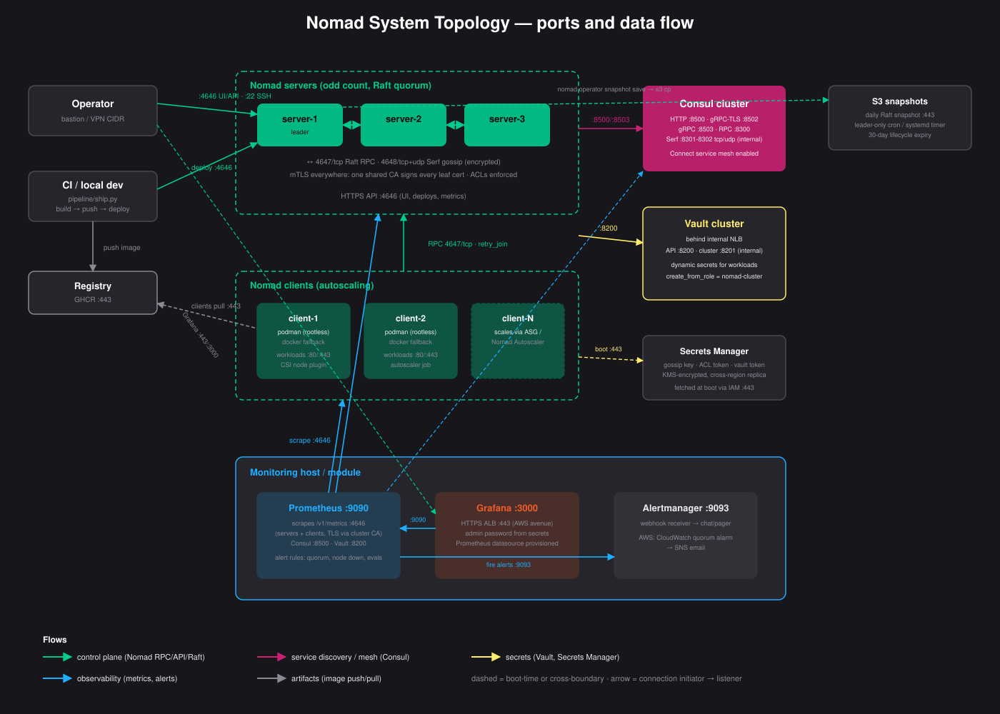

## Nomad

<p align="center">
  
</p>

Production-ready HashiCorp Nomad cluster deployment, supporting multiple hosts, multiple servers, and multiple provisioning avenues from a single config file — plus a pipeline connector that ships containers from CI or a laptop straight into the cluster as running workloads.

<p align="center">
  
</p>

### Layout

```console
nomad/
├── deploy.py                  # single entry point: renders inventory/tfvars from cluster.yml, then invokes the right avenue
├── cluster.yml.example        # copy to cluster.yml and edit
├── ansible/                   # avenue: bare metal / on-prem VMs / anything reachable over SSH
│   └── roles/
│       ├── nomad/             # TLS (shared CA), ACLs, gossip encryption, Vault, snapshots, opt-in hardening
│       └── monitoring/        # Prometheus + Grafana + Alertmanager (podman/systemd) with Nomad alert rules
├── terraform/                 # avenue: AWS, multi-region (primary + secondary)
│   ├── modules/               # vpc, nomad-cluster, consul-cluster, vault-cluster (internal NLB), monitoring
│   └── packer/                # pre-baked Ubuntu 24.04 AMI with Nomad/Consul/Vault + Podman
├── baremetal/                 # avenue: single-host quickstart, or libvirt/vSphere multi-VM test cluster via Vagrant
├── pipeline/                  # ship.py connector + GitHub/GitLab CI templates: build → push → deploy to Nomad
├── examples/                  # job specs: Connect, fluent-bit, EBS CSI plugins, Autoscaler; Sentinel policies (Enterprise)
├── docs/                      # topology diagram, rolling-upgrade runbook
└── tests/                     # tofu/tflint/packer validation image + pytest for deploy.py and ship.py
```

### Choosing an avenue

| Avenue | When to use it |
|---|---|
| `ansible` | Bare metal or existing VMs, any cloud or on-prem, SSH access |
| `terraform` | AWS: ASGs, Secrets Manager (cross-region replica), internal Vault NLB, S3 Raft snapshots, monitoring + quorum alarms |
| `baremetal/Vagrantfile` | Local multi-VM testing on KVM/QEMU (libvirt) or vSphere/ESXi before a real rollout |
| `baremetal/install-nomad.sh` | Single-node quickstart/dev, no cluster |

### Deploying the cluster

```bash
cp cluster.yml.example cluster.yml
# edit: avenue, hosts/regions, admin_cidr_blocks (operator/bastion access)

python3 deploy.py --validate-only   # check cluster.yml before touching anything
python3 deploy.py --dry-run         # render inventory/tfvars and print the commands, don't run them
python3 deploy.py                   # deploy
```

`deploy.py` enforces an odd server count (Raft quorum requires 1, 3, 5, ...) and that `features.bootstrap_expect` matches the number of hosts listed, before it ever shells out to `ansible-playbook` or `terraform`.

### Deploying workloads

`pipeline/ship.py` (stdlib-only) builds any directory with a Dockerfile, pushes it, and registers it as a Nomad job through the HTTP API, blocking until the deployment is healthy and auto-reverting on failure:

```bash
export NOMAD_ADDR=https://<server>:4646 NOMAD_TOKEN=<token> NOMAD_CACERT=ca.pem
python3 pipeline/ship.py build ../keycloak --image ghcr.io/org/keycloak:$(git rev-parse --short HEAD)
python3 pipeline/ship.py push  --image ghcr.io/org/keycloak:abc1234
python3 pipeline/ship.py deploy --image ghcr.io/org/keycloak:abc1234 --name keycloak --port 8080 --count 2
```

CI templates for GitHub Actions and GitLab live in [pipeline/](pipeline/) with token-scoping guidance.

### Design choices

- **Podman is the primary task driver; Docker is an optional fallback** (`nomad_podman_enabled`/`nomad_docker_enabled` in the ansible role, `podman_enabled` in the terraform nomad-cluster module).
- **A single shared CA signs every node's leaf certificate**, distributed once from the first server; the CA key is removed from non-authority nodes after signing.
- **ACLs enforced everywhere**; the terraform avenue bootstraps with an operator-provided token from Secrets Manager so the management token is retrievable, the ansible avenue persists it (0600) for the snapshot timer.
- **Default-deny network posture**: SSH/UI/API ports open only to `admin_cidr_blocks`; intra-cluster ports are self-referencing security group rules; workload 80/443 is separately controllable.
- **No secrets ship with defaults.** `nomad_gossip_key`/`nomad_vault_token`/`grafana_admin_password` must be supplied by the operator (ansible-vault); the AWS avenue generates them once into Secrets Manager (KMS, cross-region replica) and fetches at boot via IAM.
- **Disaster recovery is built in**: daily Raft snapshots (leader-only) to S3 or a local systemd timer, plus a written [rolling-upgrade runbook](docs/rolling-upgrade.md).
- **Consul Connect and native service discovery on**, Vault reached through an internal NLB (never localhost), CSI volumes and the Nomad Autoscaler available via [examples/](examples/) with IAM gated behind `csi_enabled`/`autoscaler_enabled` tfvars.

### Testing

Three layers, all wired into CI:

```bash
# 1. Static: tofu fmt/validate + tflint on every module, packer validate on the AMI template
docker build -t nomad-tofu-tests -f tests/Dockerfile . && docker run --rm nomad-tofu-tests

# 2. Unit: deploy.py config/rendering + ship.py validation/rendering (66 tests)
pip install -r tests/requirements.txt && pytest tests/

# 3. Live: molecule converges the real roles in systemd containers and verifies behavior
pip install molecule "molecule-plugins[podman]" ansible-core
ansible-galaxy collection install containers.podman ansible.posix community.general
(cd ansible/roles/nomad && molecule test)       # 3-node cluster: quorum, shared CA, ACLs, snapshots
(cd ansible/roles/monitoring && molecule test)  # Prometheus rules, Grafana login/datasource, Alertmanager
```

The molecule suites are full converge → idempotence → verify runs against AlmaLinux 10 systemd containers — the nomad scenario forms a real 3-server Raft cluster and asserts leader election, ACL enforcement, identical CA fingerprints on every node, and a restorable snapshot on the leader.
