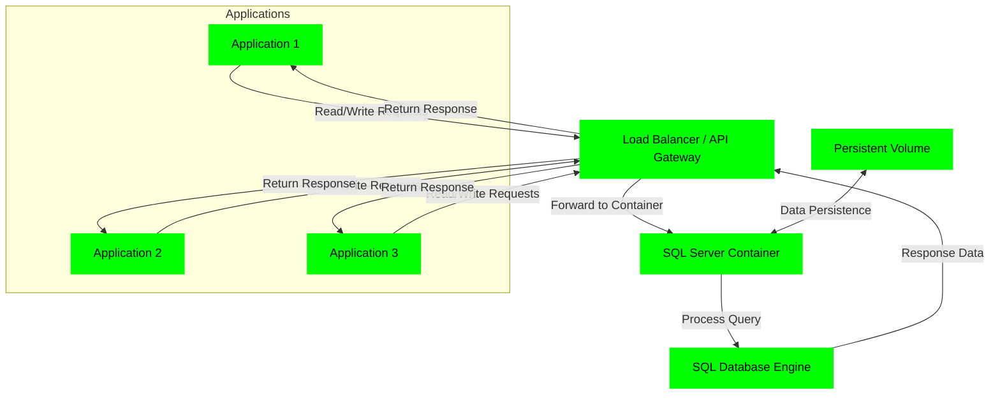
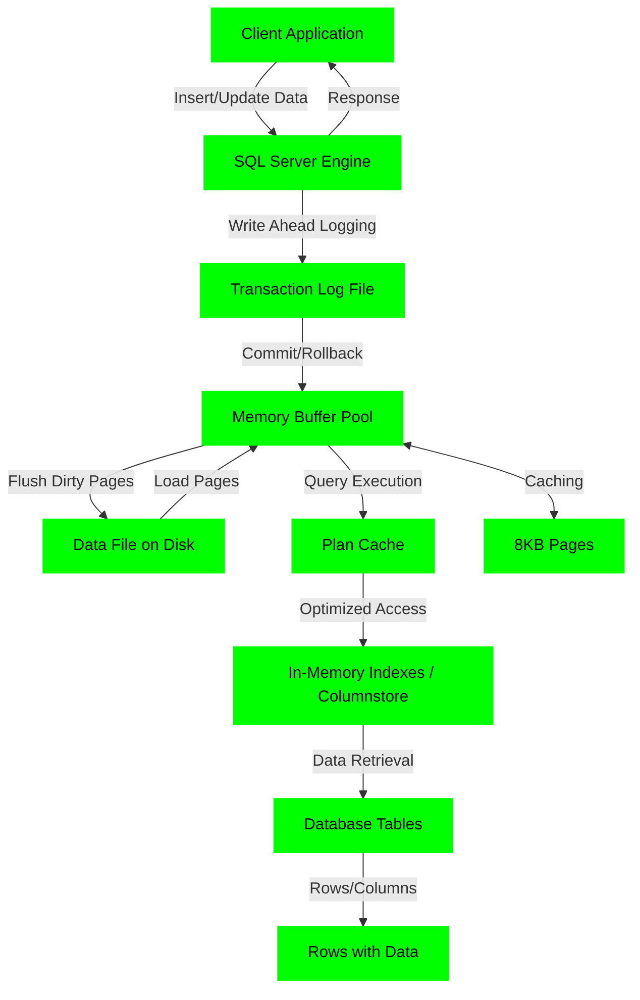

## SQL

### Application → API Gateway → SQL Container (Data Flow)



### SQL Data Flow



### The API Gateway

The gateway ([`api-gateway/`](api-gateway/)) is the single entry point in front of
the sharded SQL Server tier. It is safe by default: clients invoke **named,
server-defined operations** and never send SQL. Each operation is an
allowlisted, fully parameterized statement declared in
[`operations.json`](api-gateway/operations.json); the gateway validates the
supplied parameters, routes to a shard by the operation's key, and executes on a
**persistent per-shard connection pool**.

```
client ──JWT──> api-gateway ──pool──> shard = key % N ──> SQL Server
                  │ named operations only (operations.json)
                  │ persistent pooling, Redis shard map + rate limit
                  └ guarded raw /query (disabled by default)
```

Run it:

```sh
cd api-gateway
cp .env.example .env        # set SQL_SA_PASSWORD, JWT_SECRET, REDIS_PASSWORD
docker compose up -d --build
docker compose up -d --scale api-gateway=4     # scale the stateless tier
```

The gateway self-provisions each shard's database and schema on startup, then
listens on `127.0.0.1:3000`.

#### Endpoints

| Method + path | Auth | Purpose |
| --- | --- | --- |
| `POST /v1/op/:name` | JWT | Invoke a named operation with `{ "params": { ... } }` |
| `GET /operations` | JWT | List callable operations and their parameters |
| `POST /v1/admin/set-shard` | JWT | Pin a key to a shard (dynamic re-mapping) |
| `POST /query` | JWT | Guarded raw SQL — **404 unless `GATEWAY_ALLOW_RAW_SQL=1`**, parameterized, read-only by default |
| `GET /health` `GET /ready` | none | Liveness; readiness (Redis + every shard) |
| `GET /metrics` | none | Prometheus metrics (throughput, latency, ops per shard) |

#### Calling an operation

Every request carries a JWT (`Authorization: Bearer <token>`) and a JSON body
`{ "params": { ... } }`. Mint a token for testing with
`docker compose exec api-gateway node mint-token.js app 3600`.

- **JavaScript**
  ```javascript
  async function callOp(op, params) {
    const res = await fetch(`http://localhost:3000/v1/op/${op}`, {
      method: 'POST',
      headers: {
        'Content-Type': 'application/json',
        Authorization: `Bearer ${process.env.GATEWAY_TOKEN}`,
      },
      body: JSON.stringify({ params }),
    });
    if (!res.ok) throw new Error(`${op} failed: ${res.status}`);
    return res.json(); // { shard, rows, rowsAffected }
  }

  await callOp('create_user', { id: 42, username: 'ada', email: 'ada@example.com' });
  const { rows } = await callOp('get_user', { id: 42 });
  ```

- **Python**
  ```python
  import os, requests

  def call_op(op, params):
      r = requests.post(
          f"http://localhost:3000/v1/op/{op}",
          headers={"Authorization": f"Bearer {os.environ['GATEWAY_TOKEN']}"},
          json={"params": params},
          timeout=15,
      )
      r.raise_for_status()
      return r.json()  # {"shard": ..., "rows": [...], "rowsAffected": [...]}

  call_op("create_order", {"user_id": 42, "amount": 19.99, "status": "paid"})
  print(call_op("list_orders", {"user_id": 42, "limit": 10, "offset": 0})["rows"])
  ```

The same shape applies to any HTTP client (C# `HttpClient`, Java `HttpClient`/
OkHttp, Go, curl): `POST /v1/op/<name>` with a bearer token and a `params`
object.

#### Adding operations

Append an entry to [`operations.json`](api-gateway/operations.json) — SQL with
`@named` parameters, a `params` type map, the `shardBy` parameter, and a
`read`/`write` `mode` — then restart the gateway. Unknown operations, unknown or
mistyped parameters, and requests without a valid token are rejected before any
SQL runs.

#### Scaling and operations

- **Stateless tier**: `docker compose up -d --scale api-gateway=N` behind the
  [nginx](api-gateway/nginx/) load balancer (or Traefik/k8s).
- **Sharding**: keys route by `key % shardCount`; override per key via
  `POST /v1/admin/set-shard` (stored in Redis). Add a shard by extending
  `SQL_SHARDS` and adding a `sqlN` service.
- **Rate limiting**: global across replicas via Redis
  (`RATE_LIMIT_MAX` per `RATE_LIMIT_WINDOW_MS` per client IP).
- **Observability**: Prometheus at `/metrics`; JSON logs to stdout.
- **TLS**: terminate at nginx/your LB and forward to the gateway.

#### Load balancer (nginx or haproxy)

Front the gateway replicas with either load balancer (see [lb/](api-gateway/lb/)):

```sh
cd api-gateway
docker compose -f docker-compose.yml -f lb/docker-compose.lb.yml --profile lb-nginx   up -d --build
docker compose -f docker-compose.yml -f lb/docker-compose.lb.yml --profile lb-haproxy up -d --build
```

Both balance across three gateway replicas (published on `127.0.0.1:8088`);
haproxy also serves a stats page on `:8404`.

#### Tuned shards

Shards run a tuned SQL Server image ([Dockerfile.mssql](api-gateway/Dockerfile.mssql)
+ [mssql-tune.sql](api-gateway/mssql-tune.sql)): bounded MAXDOP, raised cost
threshold, optimize-for-ad-hoc, capped memory, multiple tempdb files, Query
Store, and RCSI — addressing the pressure points the health check surfaces
under load.

#### Testing

```sh
cd api-gateway
./uat/run-uat.sh                       # functional battery (ops, sharding, auth, persistence)
./stress/run-stress.sh 100 30s 1       # k6 load test (throughput/latency/error thresholds)
./uat/final-uat.sh nginx               # end to end: LB routing + tuning + shard data flow + stress
./uat/final-uat.sh haproxy
./stress/scale-bench.sh 80 20s         # 1-shard vs 2-shard write benchmark
```

Measured results and the case for horizontal shard scaling are written up in
[uat/REPORT.md](api-gateway/uat/REPORT.md).

#### Multi-host deployment

To deploy each component (LB, gateways, redis, shards) on separate VMs or
bare metal, see [ansible/](api-gateway/ansible/).

### Connecting to SQL Server Docker Container (Admin Purposes)
---

Before connecting with SSMS or Azure Data Studio, ensure the following:
- **Container Running**: Verify the SQL Server container is active (`docker ps`). Use an official image like `mcr.microsoft.com/mssql/server:2025-latest`.
- **Port Exposed**: Map port 1433 to the host (e.g., `-p 1433:1433` in `docker run` or docker-compose). If custom port, use it in connection (e.g., `localhost,1434`).
- **SA Password**: Set via `MSSQL_SA_PASSWORD` environment variable (strong password required: 8+ chars, upper/lower/number/symbol).
- **Mixed Mode Authentication**: Enabled by default in containers (allows SQL logins like SA). If not, exec into container and run: `sqlcmd -S localhost -U sa -P <password> -Q "ALTER LOGIN sa ENABLE; EXEC sp_configure 'contained database authentication', 1; RECONFIGURE;"`.
- **Firewall/Network**: Allow inbound TCP 1433 on host firewall. For remote access, use host IP (not localhost).
- **Tools Installed**: SSMS (Windows) from Microsoft downloads; Azure Data Studio (cross-platform) from Microsoft.
- **Container Config**: Ensure `ACCEPT_EULA=Y` env var is set. For Linux hosts, allocate 4GB+ memory to Docker.

### Connecting with SSMS (SQL Server Management Studio)
---

1. Launch SSMS.
2. In "Connect to Server":
   - Server name: `localhost` (or host IP).
   - Authentication: SQL Server Authentication.
   - User name: `sa`.
   - Password: Your `MSSQL_SA_PASSWORD`.
3. Click "Connect".

### Connecting with Azure Data Studio
---

1. Launch Azure Data Studio.
2. Click "New Connection".
3. In "Connection Details":
   - Server: `localhost` (or host IP).
   - Authentication type: SQL Login.
   - User name: `sa`.
   - Password: Your `MSSQL_SA_PASSWORD`.
   - Database: `<default>` or "master".
4. Click "Connect".

---

> **API security note**: a hardened, firewall-fronted version of this gateway/shard
> architecture lives at [api-firewall/integrations/sql-backend](../api-firewall/integrations/sql-backend/) —
> OpenAPI positive-security validation + OWASP CRS WAF in front of a scalable API tier
> over sharded SQL Server.